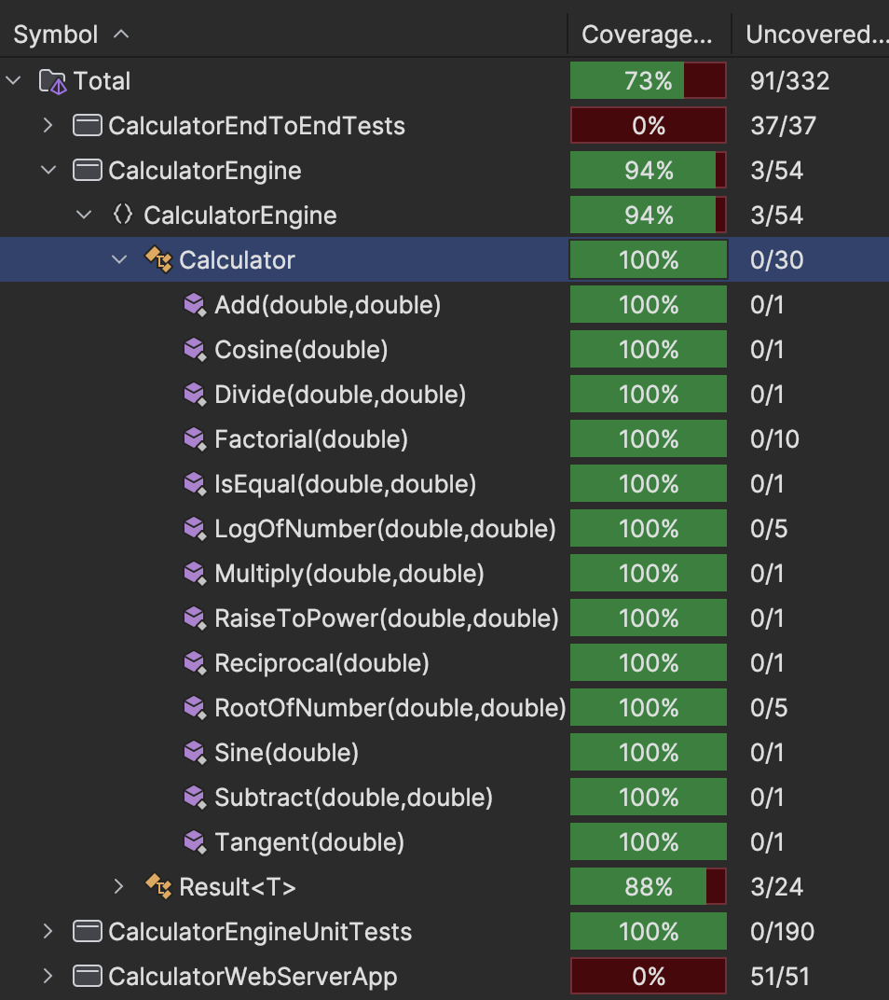

# KSU SWE 3643 Software Testing and Quality Assurance Semester Project: Web-Based Calculator
This repository contains a web-based calculator application developed using C# and ASP.NET Blazor. It's designed to reinforce testing concepts and provide valuable coding practice.

## Table of Contents
- [Environment](#environment)
- [Executing the Web Application](#executing-the-web-application)
- [Executing Unit Tests](#executing-Unit-Tests)
- [Reviewing Unit Test Coverage](#reviewing-Unit-Test-Coverage)
- [Executing End-To-End Tests](#executing-End-To-End-Tests)
- [Final Video Presentation](#final-Video-Presentation)
  
## Team Members
Jacob Germana-McCray

## Architecture
My project is split into the following sub-projects:
- CalculatorEngine
- CalculatorEngineUnitTests
- CalculatorWebServerApp
- CalculatorEndToEndTests

This is done to seperate the different functionalities of the program, and make it easier to test in a modular fashion.

## Environment
First, check your .NET SDK version. This project relies on .NET8.0, so you must have it installed to properly run the app. To do so, open your terminal or command prompt and type the following:
```bash
dotnet --version
```
This will show you the version of your .NET SDK. If you see an error, install the SDK by going to the [.NET download page](https://dotnet.microsoft.com/download).

## Executing the Web Application

First, clone, enter & set up the dependencies for the repository:
```bash
git clone https://github.com/JGM01/Web-calculator.git
cd web-calculator
dotnet restore
dotnet build
```

After this, you can simply use 
```bash
dotnet run --project CalculatorWebServerApp
```
To launch the web app. You can access the calculator webpage by going to the localhost port specified in the terminal output:
```bash
info: Microsoft.Hosting.Lifetime[14]
      Now listening on: http://localhost:5231  <-- HERE
info: Microsoft.Hosting.Lifetime[0]
      Application started. Press Ctrl+C to shut down.
info: Microsoft.Hosting.Lifetime[0]
      Hosting environment: Development
```

## Executing Unit Tests
To Execute the unit tests, remain in the root directory of the project and use the following command:
```bash
dotnet test CalculatorEngineUnitTests
```
This will run all of the unit tests for the CalculatorEngine project.

## Reviewing Unit Test Coverage


Here the unit-test coverage data shows that we achieve 100% statement coverage of the CalculatorEngine Calculator class.

## Executing End-To-End Tests
First, you must get all playwright dependencies in order. To do so, you need the `pwsh` command, which is found in the [PowerShell](https://learn.microsoft.com/en-us/powershell/scripting/install/installing-powershell?view=powershell-7.4) app. Install and get it set up for your operating system, and run the following commands from inside PowerShell in the Web-Calculator root directory:
```bash
pwsh CalculatorEndToEndTests/bin/Debug/net8.0/playwright.ps1 install
```
Once this is accomplished, exit out of PowerShell and enter your normal terminal.

To execute the end-to-end tests, you must ensure that the `CalculatorWebServerApp` is running. Without this, all the tests will fail.

The preferred way to do this is to open two terminal windows/tabs, and have the Web Server running in one:
```bash
dotnet run --project CalculatorWebServerApp
```
and the following command ran in the other:
```bash
dotnet test CalculatorEndToEndTests
```
This will run all the end-to-end tests.
**Note**: For some reason I cannot explain, the first end-to-end test run on a new web server instance will result in a failure of the first test. I do not know why, but if you run the test command a second time it should pass.

## Final Video Presentation
The final video presentation can be found [here](https://youtu.be/UPjySdwqY5w).
